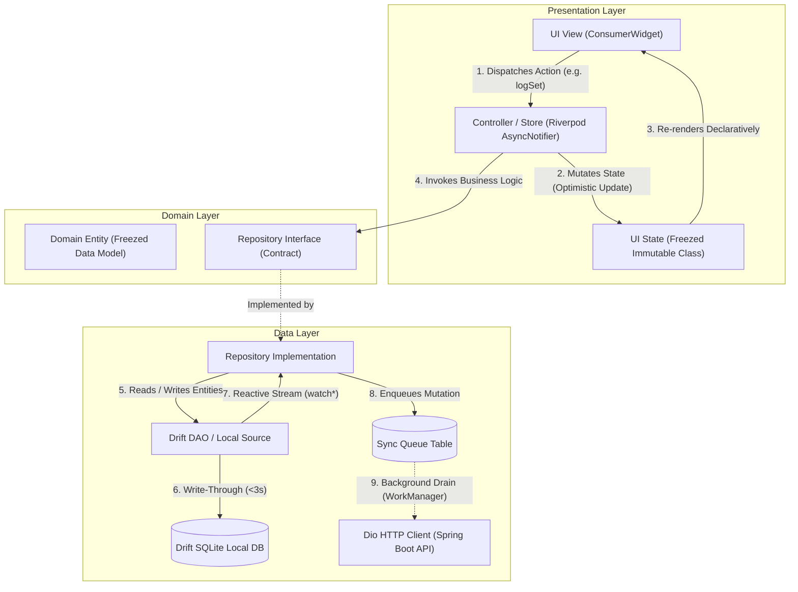

# ARCHITECTURE.md — System Architecture & Implementation Blueprint

> **Project:** Aven Fit (Offline-First Gym & Indian Nutrition Tracker)  
> **Platform:** Android-First (Flutter + Dart client · Spring Boot + PostgreSQL cloud)  
> **Version:** 1.0.0 (Ratified Stack: Riverpod 3.x, GoRouter 18, Drift 2.34+, Freezed 4)  
> **Source of Truth:** Repository root. Applies to all engineering agents & contributors.

---

## 1. Architectural Philosophy & Core Laws

Aven Fit is designed ground-up as an **Offline-First, High-Performance Mobile Client** optimized for budget Android devices (₹8,000–₹15,000 class). 

The architecture strictly adheres to the core system laws:
- **L1 (Sub-3s Logging):** Every user action commits write-through to local storage with optimistic UI updates before any asynchronous work.
- **L2 (Offline-First Primacy):** The local SQLite database via Drift is the primary source of truth during all live usage. Network connectivity is never a precondition for core application workflows.
- **L7 (Crash Resilience):** State changes persist synchronously across app lifecycle boundaries; active sessions survive process death and restores via epoch math.
- **L8 (Battery & OS Respect):** Zero CPU polling. Timers rely on monotonic system timestamps; background synchronization is scheduled via OS constraints (`WorkManager`).

---

## 2. Feature-First Clean Architecture

The client application (`mobile/lib/`) is structured strictly around **Feature-First Clean Architecture**. Features are self-contained vertical slices that own their entire domain, data, and presentation lifecycles.

```
mobile/lib/
├── core/                           # Shared primitives & global infrastructure
│   ├── database/                   # Drift SQLite AppDatabase & schema migrations
│   ├── network/                    # Dio HTTP client, interceptors & error handlers
│   ├── router/                     # GoRouter declarative routing & shell navigation
│   ├── sync/                       # WorkManager background dispatcher
│   └── theme/                      # Sharp Glassmorphism design tokens & typography
│
└── features/                       # Self-contained vertical feature slices
    ├── workout/                    # Active workout engine & session tracking
    ├── routine/                    # Routine templates, schedules & builder
    ├── nutrition/                  # Indian food DB (5k items), household units & macro math
    ├── history/                    # Progress charts, PR records & historical logs
    └── sync/                       # Sync queue draining, conflict resolution & cloud hub
        ├── domain/                 # 1. Pure immutable entities, value objects & contracts
        ├── data/                   # 2. Drift tables, DAOs, local sources & repository impl
        └── presentation/           # 3. Freezed UI state, Riverpod controllers & Consumer views
```

### Architectural Boundary Rules
1. **Feature Encapsulation:** Features must NEVER import internal implementation details from other feature directories (`lib/features/workout/data/` cannot import `lib/features/nutrition/data/`).
2. **Shared Infrastructure:** Shared logic lives exclusively in `lib/core/`. Features depend on `lib/core/`, but `lib/core/` NEVER depends on any feature.
3. **Layer Dependency Hierarchy:** Dependencies flow strictly inwards:
   $$\text{Presentation} \longrightarrow \text{Domain} \longleftarrow \text{Data}$$
   - **Domain:** Pure Dart. Zero imports from Flutter UI, Drift, or HTTP clients.
   - **Data:** Implements Domain repository contracts; interacts with Drift SQLite and Dio.
   - **Presentation:** Interacts with Domain models and consumes Repository interfaces through Riverpod Notifiers.

---

## 3. Layer Responsibilities & Contracts



### 3.1 Domain Layer (`features/<feature>/domain/`)
- **Role:** The core business heart of the application. Completely isolated from platforms, databases, and UI frameworks.
- **Components:**
  - **Entities & Value Objects:** Immutable data models generated via Freezed 4 and `@freezed` with JSON serialization support (`json_serializable`).
  - **Enums & Domain Logic:** Statuses, type definitions, and pure business calculations (e.g., volume calculation, 1RM Brzycki/Epley formulas, macro gram arithmetic).
- **Rule:** Zero imports of `package:flutter/material.dart`, `package:drift/drift.dart`, or `package:dio/dio.dart`.

### 3.2 Data Layer (`features/<feature>/data/`)
- **Role:** Persistent storage, data retrieval, and data transformation.
- **Components:**
  - **Drift Tables:** Schema definitions with client-generated UUID primary keys (`TextColumn get id => text()()`).
  - **Local Data Sources & DAOs (`@DriftAccessor`):** Isolate-safe compile-time SQL queries exposing reactive streams (`watch*()`) and batch transactional mutations.
  - **Repository Implementation:** Implements the Domain repository contract. Translates Drift database rows to pure Freezed Domain entities and vice versa. Manages offline sync queueing.
- **Rule:** Every write operation is a write-through to SQLite before returning.

### 3.3 Presentation Layer (`features/<feature>/presentation/`)
- **Role:** Visual presentation and unidirectional state management.
- **Components:**
  - **UI State (`@freezed`):** Pure immutable state record representing the complete visual state of a screen (e.g. current session, set list, rest timer countdown, loading state, error banners).
  - **Store / Controller (`@riverpod` / `AsyncNotifier`):** Unidirectional state container. Listens to repository streams, processes user actions, updates state immutably, and triggers write operations.
  - **Declarative View (`ConsumerWidget`):** Fast, stateless or lifecycle-aware widgets observing Riverpod providers and styling widgets with Sharp Glassmorphism design tokens (`AppTheme`).
- **Rule:** Explicitly NO legacy `ChangeNotifier`, two-way binding, or state mutations inside widgets.

---

## 4. Unidirectional Data Flow (The 5-Step Cycle)

```
[ User Interaction: Tap '✓' Set Complete ]
                     │
                     ▼
 1. UI Event Dispatch (ConsumerWidget calls ref.read(activeWorkoutControllerProvider.notifier).toggleSet(...))
                     │
                     ▼
 2. Controller Optimistic Update (Controller updates Freezed UI State immediately)
                     │
                     ▼
 3. Repository Write-Through (Repository calls DAO.updateSetRecord(...))
                     │
                     ▼
 4. SQLite Transaction Commit (Drift executes query in background isolate; emits reactive stream)
                     │
                     ▼
 5. Declarative UI Re-render (ConsumerWidget rebuilds with updated state in <16ms)
```

---

## 5. Blueprint for New Feature Slices

When creating a new vertical slice (e.g., `features/routine`, `features/nutrition`, `features/history`), engineers and agents must follow this sequential implementation order:

```
Step 1: Domain Models (lib/features/<slice>/domain/)
        ├── Define Freezed immutable entities (<slice>_model.dart)
        └── Define domain enums and business calculation utilities

Step 2: Data Layer (lib/features/<slice>/data/)
        ├── Define Drift table schema (<slice>_tables.dart)
        ├── Register table in AppDatabase (lib/core/database/app_database.dart)
        ├── Implement DAO with reactive watch queries (<slice>_local_source.dart)
        ├── Define Repository interface (<slice>_repository.dart)
        └── Implement Repository with Riverpod provider (<slice>_repository_impl.dart)

Step 3: Presentation Layer (lib/features/<slice>/presentation/)
        ├── Define Freezed UI State (<slice>_state.dart)
        ├── Implement Riverpod AsyncNotifier (<slice>_controller.dart)
        └── Implement ConsumerWidget screen (<slice>_screen.dart)

Step 4: Router Registration (lib/core/router/app_router.dart)
        └── Wire screen to GoRouter shell branch or declarative route

Step 5: Verification & Codegen
        ├── Run: dart run build_runner build --delete-conflicting-outputs
        ├── Run: flutter analyze (must yield 0 issues)
        └── Run: flutter test (must pass 100%)
```

---

## 6. Testing Strategy & Quality Matrix

| Layer | Testing Target | Tooling | Isolation / Mocking |
|:---|:---|:---|:---|
| **Domain** | Entity immutability, copyWith, serialization, formulas | `test`, `mocktail` | Pure unit tests, zero mocking needed |
| **Data (DAO)** | SQL schema, queries, reactive streams, cascade deletes | `drift/native`, in-memory SQLite | `NativeDatabase.memory()`, deterministic DB assertions |
| **Data (Repo)** | Model mapping, sync queue enrollment, error translation | `mocktail` | Mock DAO & API clients |
| **Presentation** | Controller state transitions, optimistic updates, timer math | `ProviderContainer`, `flutter_test` | Mock Repository via `overrideWithValue` |
| **End-to-End** | Full offline user journeys (J1–J6 per AGENTS.md) | `patrol`, `integration_test` | Real SQLite DB on budget Android emulator |

---

## 7. Technology Stack Reference (Ratified)

- **Mobile Framework:** Flutter (Dart 3.13+)
- **State Management:** Riverpod 3.x (`flutter_riverpod: ^3.4.2`, `riverpod_annotation: ^4.0.6`)
- **Navigation:** GoRouter 18 (`go_router: ^18.0.0`)
- **Local Persistence:** SQLite via Drift 2.34+ (`drift: ^2.34.3`, `drift_flutter: ^0.3.1`, `sqlite3_flutter_libs: ^0.6.0+eol`)
- **Model Generation:** Freezed 4 (`freezed: ^4.0.1`, `freezed_annotation: ^3.1.0`)
- **Networking:** Dio 5.8+ (`dio: ^5.8.0+1`)
- **Background Tasks:** WorkManager 0.10+ (`workmanager: ^0.10.9`)
- **UI Design Token System:** Sharp Glassmorphism OLED Black (`AppTheme.oledBlack`, `AppTheme.neonCyan`, `AppTheme.voltGreen`, `AppTheme.burntOrange`)
- **Icons:** `lucide_icons_flutter: ^3.1.17`
