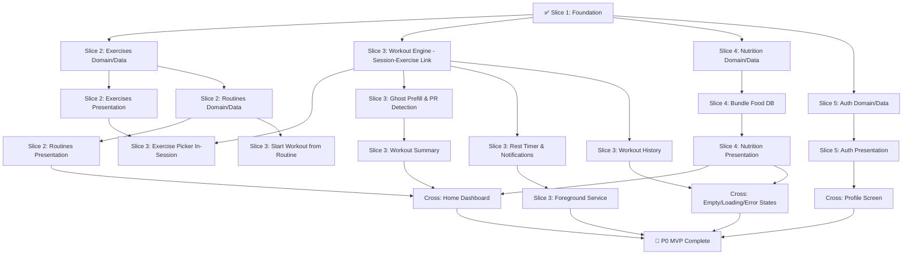

# Aven Fit — Comprehensive Multi-Agent Implementation Plan

> **Generated:** 2026-08-31 · **Branch:** `dev` · **Head:** `4f7ff29`
> **Goal:** Complete P0 MVP — all core offline flows functional, locally testable, ship-ready.

---

## Current State Assessment

### What's Done (Slice 1 — Foundation ✅)

| Layer | Status | Details |
|:------|:-------|:--------|
| **Flutter scaffold** | ✅ | Feature-first dirs, GoRouter 18 shell routes, Riverpod 3.4, Drift SQLite, Sentry, WorkManager entrypoint, Patrol config, Glassmorphism theme |
| **Workout reference slice** | ✅ | `WorkoutSession`/`WorkoutSet` Freezed models, Drift DAO with reactive streams, `ActiveWorkoutController` AsyncNotifier, `ActiveWorkoutScreen` UI, 12 passing tests |
| **Backend (all domains)** | ✅ | Spring Boot 3.3 + Java 21, Flyway V1–V10 migrations, JWT auth, REST APIs for exercises/routines/workouts/nutrition/analytics/sync, 200+ seeded exercises, 201 Indian foods, comprehensive integration tests |
| **Toolchain** | ✅ | Windows cross-drive fix, Kotlin 2.0, build_runner codegen verified, `flutter analyze` 0 issues |

### What's Remaining (Slices 2–5 + Cross-Cutting)

The backend is **substantially complete** across all domains. The primary work is **Flutter mobile implementation** — building out the 4 remaining vertical slices plus cross-cutting P0 concerns. Each slice below is broken into agent-sized work units.

---

## Work Unit Design Philosophy

Each work unit (WU) is scoped for **a single AI agent session**:

| Constraint | Budget |
|:-----------|:-------|
| New files created | 5–12 files |
| Lines of code | 400–1,200 LOC |
| Scope | One layer of one feature (domain, data, or presentation) |
| Dependencies | Clearly stated; all inputs must exist before starting |
| Verification | Each WU ends with a concrete pass/fail check |
| Duration | ~30–90 min of agent execution |

> [!IMPORTANT]
> **Agent coordination rule:** Two agents must NEVER edit the same file simultaneously. Work units are designed so that concurrent agents work in separate file trees. After completing a WU, the agent must commit, update HANDOFF.md, and run `dart run build_runner build` if domain/data models changed.

---

## Dependency Graph (Read Bottom-Up)

---

## Slice 2: Exercises & Routines

> **Backend status:** ✅ Complete (`/api/v1/exercises`, `/api/v1/routines`, V2/V4/V7/V8 migrations, integration tests)
> **Mobile status:** 🔵 Scaffolded dirs with `.gitkeep` placeholders

### WU-2.1 — Exercise Domain Models & Drift Tables

| Field | Value |
|:------|:------|
| **Agent** | Any |
| **Depends on** | Slice 1 ✅ |
| **Scope** | `mobile/lib/features/exercise/domain/` + `mobile/lib/features/exercise/data/` (tables only) |
| **Files to create** | |

- `features/exercise/domain/exercise.dart` — Freezed `Exercise` model (`id`, `name`, `muscleGroupPrimary`, `muscleGroupsSecondary`, `equipmentType`, `instructions`, `isCustom`, `isFavourite`, `isTimeBased`, `isCardio`)
- `features/exercise/domain/muscle_group.dart` — Freezed `MuscleGroup` model + `Equipment` enum + `MuscleRole` enum
- `features/exercise/data/exercise_tables.dart` — Drift tables: `Exercises`, `MuscleGroups`, `ExerciseMuscleGroups`
- Update `core/database/app_database.dart` — Register new tables, bump schema version

**Verification:** `dart run build_runner build` succeeds, `flutter analyze` 0 issues.

---

### WU-2.2 — Exercise DAO & Repository

| Field | Value |
|:------|:------|
| **Agent** | Any |
| **Depends on** | WU-2.1 |
| **Scope** | `features/exercise/data/` |

- `features/exercise/data/exercise_local_source.dart` — Drift DAO: `searchExercises(query)`, `getExerciseById(id)`, `watchFavourites()`, `toggleFavourite(id)`, `createCustomExercise(...)`, `getAllByMuscleGroup(group)`, `getAllByEquipment(equip)`
- `features/exercise/data/exercise_repository.dart` — Repository interface + Riverpod provider impl wrapping DAO
- `features/exercise/data/exercise_seed_data.dart` — Dart asset loader that reads bundled exercises JSON from `assets/data/exercises.json` and populates SQLite on first launch (or schema migration)

**Verification:** In-memory Drift unit test: insert exercises → search → assert results <100ms. `flutter test` passes.

---

### WU-2.3 — Exercise Seed Data Asset

| Field | Value |
|:------|:------|
| **Agent** | Any |
| **Depends on** | WU-2.1 |
| **Can run parallel with** | WU-2.2 |
| **Scope** | `mobile/assets/data/` + backend seed extraction |

- Extract the 200+ exercises from backend `V8__seed_exercises.sql` into a `exercises.json` asset file with all fields (name, muscles, equipment, instructions)
- Extract muscle groups from `V7__seed_muscle_groups.sql` into `muscle_groups.json`
- Register assets in `pubspec.yaml`
- Create `features/exercise/data/exercise_seed_loader.dart` — reads JSON, batch-inserts into Drift on first-run (guarded by a `metadata` table flag or schema version check)

**Verification:** JSON files parse correctly, loader populates 200+ rows in in-memory DB test.

---

### WU-2.4 — Exercise List & Search Screen

| Field | Value |
|:------|:------|
| **Agent** | Any |
| **Depends on** | WU-2.2, WU-2.3 |
| **Scope** | `features/exercise/presentation/` |

- `features/exercise/presentation/exercise_list_controller.dart` — Riverpod AsyncNotifier: debounced search query, muscle group filter chips, equipment filter, favourites toggle
- `features/exercise/presentation/exercise_list_screen.dart` — Glassmorphism UI: search bar, horizontal filter chips (muscle groups, equipment), scrollable exercise list tiles with muscle badge, favourite star icon, tap → navigate to detail
- `features/exercise/presentation/exercise_search_delegate.dart` — Reusable search widget component (used later by exercise picker in WU-3.3)

**Verification:** Screen renders with 200+ exercises, search filters in <300ms, `flutter analyze` 0 issues.

---

### WU-2.5 — Exercise Detail & Custom Exercise Screen

| Field | Value |
|:------|:------|
| **Agent** | Any |
| **Depends on** | WU-2.4 |
| **Scope** | `features/exercise/presentation/` |

- `features/exercise/presentation/exercise_detail_screen.dart` — Exercise name, muscle groups, equipment, instructions text, favourite toggle, performance history placeholder (wired in Slice 3)
- `features/exercise/presentation/create_custom_exercise_screen.dart` — Form: name (unique validation), primary muscle group dropdown, secondary muscles multi-select, equipment dropdown, instructions text field. Saves via repository.

**Verification:** Navigate to detail from list, create custom exercise, verify it appears in search. `flutter test` widget tests pass.

---

### WU-2.6 — Routine Domain Models & Drift Tables

| Field | Value |
|:------|:------|
| **Agent** | Any |
| **Depends on** | WU-2.1 (Exercise models must exist) |
| **Can run parallel with** | WU-2.4, WU-2.5 |
| **Scope** | `features/routine/domain/` + `features/routine/data/` (tables only) |

- `features/routine/domain/routine.dart` — Freezed `Routine` model (`id`, `name`, `description`, `estimatedDurationSeconds`, `createdAt`, `updatedAt`)
- `features/routine/domain/routine_exercise.dart` — Freezed `RoutineExercise` model (`id`, `routineId`, `exerciseId`, `orderIndex`, `targetSetsCount`, `targetWeightKg`, `targetReps`, `targetRpe`, `restSeconds`)
- `features/routine/data/routine_tables.dart` — Drift tables: `Routines`, `RoutineExercises`
- Update `core/database/app_database.dart` — Register routine tables

**Verification:** `dart run build_runner build` succeeds, `flutter analyze` 0 issues.

---

### WU-2.7 — Routine DAO & Repository

| Field | Value |
|:------|:------|
| **Agent** | Any |
| **Depends on** | WU-2.6 |
| **Scope** | `features/routine/data/` |

- `features/routine/data/routine_local_source.dart` — Drift DAO: `watchAllRoutines()`, `getRoutineWithExercises(id)`, `createRoutine(...)`, `updateRoutine(...)`, `deleteRoutine(id)`, `addExerciseToRoutine(...)`, `removeExerciseFromRoutine(...)`, `reorderExercises(routineId, newOrder)`
- `features/routine/data/routine_repository.dart` — Repository interface + Riverpod provider impl

**Verification:** In-memory Drift unit test: create routine → add exercises → reorder → delete. `flutter test` passes.

---

### WU-2.8 — Routines List Screen

| Field | Value |
|:------|:------|
| **Agent** | Any |
| **Depends on** | WU-2.7 |
| **Scope** | `features/routine/presentation/` |

- `features/routine/presentation/routine_list_controller.dart` — Riverpod AsyncNotifier wrapping `watchAllRoutines()`
- `features/routine/presentation/routine_list_screen.dart` — Replace placeholder. Glassmorphism list: routine name, exercise count badge, estimated duration, tap → detail, FAB → create new routine. Empty state per L6 ("No routines yet — create your first one").

**Verification:** Screen renders routines reactively, empty state displays correctly. `flutter analyze` 0 issues.

---

### WU-2.9 — Routine Builder / Editor Screen

| Field | Value |
|:------|:------|
| **Agent** | Any |
| **Depends on** | WU-2.7, WU-2.4 (needs exercise picker) |
| **Scope** | `features/routine/presentation/` |

- `features/routine/presentation/routine_editor_controller.dart` — Manages routine creation/edit state: metadata (name, description), ordered exercise list with targets
- `features/routine/presentation/routine_editor_screen.dart` — Two-section form:
  1. **Metadata section:** Name text field, description text field
  2. **Exercises section:** ReorderableListView of exercise cards, each showing target sets × weight × reps, rest seconds. "Add Exercise" button opens exercise picker (from WU-2.4). Swipe-to-remove with confirmation (L7).
- `features/routine/presentation/routine_exercise_editor_sheet.dart` — Bottom sheet to edit per-exercise targets (sets count, target weight, target reps, rest seconds)

**Verification:** Create a routine with 3 exercises, set targets, reorder, save, verify persistence across app restart. `flutter test` passes.

---

### WU-2.10 — Routine Detail & Start Workout

| Field | Value |
|:------|:------|
| **Agent** | Any |
| **Depends on** | WU-2.9 |
| **Scope** | `features/routine/presentation/` |

- `features/routine/presentation/routine_detail_screen.dart` — Read-only view of routine: name, description, exercise list with targets displayed, "Edit" button → editor, **"START WORKOUT"** button → creates pre-named `WorkoutSession` from routine template, populates session exercises, navigates to Active Workout screen
- `features/routine/presentation/routine_detail_controller.dart` — Loads routine with exercises, handles "start from routine" logic: creates session + session exercises in single Drift transaction, sets `sourceRoutineId`

**Verification:** Start workout from routine → verify session created with correct exercises and target prefills. Original routine row is unmutated (L7). `flutter test` passes.

---

### WU-2.11 — Slice 2 Tests & Integration

| Field | Value |
|:------|:------|
| **Agent** | Any |
| **Depends on** | WU-2.2 through WU-2.10 |
| **Scope** | `mobile/test/features/exercise/`, `mobile/test/features/routine/` |

- `test/features/exercise/exercise_domain_test.dart` — Freezed model immutability, copyWith, JSON serialization
- `test/features/exercise/exercise_dao_test.dart` — In-memory Drift: CRUD, search, filter, favourites, custom exercises
- `test/features/routine/routine_domain_test.dart` — Freezed model tests
- `test/features/routine/routine_dao_test.dart` — In-memory Drift: CRUD, reorder, exercise management
- `test/features/routine/routine_start_workout_test.dart` — Start-from-routine creates correct session, doesn't mutate routine

**Verification:** `flutter test` all pass, `flutter analyze` 0 issues.

---

## Slice 3: Active Workout Engine

> **Backend status:** ✅ Complete
> **Mobile status:** Reference slice exists (`ActiveWorkoutController`, `ActiveWorkoutScreen`). Needs major feature expansion.

> [!IMPORTANT]
> Slice 3 is the **largest and most complex** slice. It contains the core product loop (L1: logging faster than lifting). Multiple agents can work on it in parallel using the sub-unit dependencies below.

### WU-3.1 — Session-Exercise Data Layer

| Field | Value |
|:------|:------|
| **Agent** | Any |
| **Depends on** | WU-2.1 (Exercise tables) |
| **Scope** | `features/workout/domain/` + `features/workout/data/` |

- `features/workout/domain/session_exercise.dart` — Freezed `SessionExercise` model (`id`, `sessionId`, `exerciseId`, `orderIndex`, `notes`, `restSecondsOverride`)
- `features/workout/data/workout_tables.dart` — **MODIFY**: Add `SessionExercises` Drift table linking sessions ↔ exercises with order
- `features/workout/data/workout_local_source.dart` — **MODIFY**: Add DAO methods: `addExerciseToSession(...)`, `removeExerciseFromSession(...)`, `reorderSessionExercises(...)`, `watchSessionExercisesWithSets(sessionId)` (joined query returning exercises with their sets)
- Update `WorkoutSet` / `WorkoutSets` table to reference `sessionExerciseId` instead of raw `exerciseId`

> [!WARNING]
> This WU modifies the existing workout reference slice tables. The agent must preserve all existing tests and update them for the new schema. Run `flutter test` after changes to verify no regressions.

**Verification:** Existing 12 tests updated and passing. New DAO tests for session-exercise CRUD. `flutter analyze` 0 issues.

---

### WU-3.2 — Ghost Prefill Logic

| Field | Value |
|:------|:------|
| **Agent** | Any |
| **Depends on** | WU-3.1 |
| **Scope** | `features/workout/data/` + `features/workout/domain/` |

- `features/workout/domain/ghost_set.dart` — Freezed `GhostSet` value object (`weightKg`, `reps`, `source`: `HISTORY` | `ROUTINE_TARGET` | `PREVIOUS_SET`)
- `features/workout/data/ghost_prefill_service.dart` — Riverpod provider implementing the standard set population logic from FEATURES.md §7.2:
  - If set N ≤ history count → ghost from historical set N
  - If set N > history count → ghost from set N-1
  - If no history but routine target exists → ghost from routine target
  - Fallback: empty (no ghost)
- Query: last completed session containing the same exercise, ordered by set number

**Verification:** Unit tests covering all 4 ghost prefill branches. Edge cases: first-ever exercise, more sets than history, routine-sourced targets.

---

### WU-3.3 — Exercise Picker (In-Session Mode)

| Field | Value |
|:------|:------|
| **Agent** | Any |
| **Depends on** | WU-2.2, WU-3.1 |
| **Scope** | `features/workout/presentation/` |

- `features/workout/presentation/exercise_picker_screen.dart` — Full-screen modal for adding exercises to active session:
  - Search bar (reuses search delegate from WU-2.4)
  - "Recent" section: last 10 exercises used (query from session history)
  - "Favourites" section: starred exercises
  - Muscle group / equipment filter chips
  - Tap exercise → adds `SessionExercise` to active session → returns to workout screen
- `features/workout/presentation/exercise_picker_controller.dart` — Manages recent exercises query, delegates search to exercise repository

**Verification:** Open picker during active session, search for exercise, select, verify it appears in session. <300ms search latency.

---

### WU-3.4 — Active Workout Screen Rebuild

| Field | Value |
|:------|:------|
| **Agent** | Any |
| **Depends on** | WU-3.1, WU-3.2, WU-3.3 |
| **Scope** | `features/workout/presentation/` |

> [!IMPORTANT]
> This is a **major rewrite** of the existing `active_workout_screen.dart` and `active_workout_controller.dart`. The reference slice was a proof-of-concept; this WU rebuilds it into the production workout logging experience.

- **MODIFY** `active_workout_controller.dart`:
  - Session lifecycle: create/resume/pause/finish with epoch math
  - Exercise block management: add/remove/reorder exercises
  - Set management per exercise: add set, confirm set (✓ button), delete set with 5s undo snackbar
  - Ghost prefill integration (from WU-3.2)
  - Optimistic UI updates with write-through to SQLite (L1/L7)
  - One-session conflict rule enforcement
- **MODIFY** `active_workout_screen.dart`:
  - Auto-named header (time-of-day + routine name if from routine)
  - Elapsed timer (epoch math, not polling — L8)
  - Scrollable exercise blocks, each with:
    - Exercise name + muscle badge
    - Set table: rows with set number, ghost hint text, weight input, reps input, ✓ confirm button
    - Quick-steppers (+/- 2.5 kg) on weight field
    - "Add Set" button per exercise
  - "Add Exercise" FAB → opens picker (WU-3.3)
  - "Finish Workout" button with confirmation dialog (L7)
  - Keep screen awake (`wakelock_plus` or similar)
- **MODIFY** `active_workout_state.dart` — Expand Freezed state to include exercise blocks with sets, ghost data, elapsed time

**Verification:** Full manual flow: start session → add 2 exercises → log 3 sets each with ghost hints → finish. All sets persisted in SQLite. <3s per set confirmation (L1).

---

### WU-3.5 — Rest Timer & Notification

| Field | Value |
|:------|:------|
| **Agent** | Any |
| **Depends on** | WU-3.4 |
| **Scope** | `features/workout/presentation/` + `core/notifications/` |

- `core/notifications/notification_service.dart` — Android notification channel setup, permission request (just-in-time primer), show/update/cancel notification methods
- `features/workout/presentation/rest_timer_controller.dart` — Riverpod provider:
  - Starts on set confirmation (default 90s, configurable per exercise)
  - Epoch-based countdown (L8 — no polling, uses `Stream.periodic` for UI ticks only)
  - +15s / -15s adjustment buttons
  - Auto-cancels when next set is logged
  - Updates Android notification with countdown
- `features/workout/presentation/widgets/rest_timer_bar.dart` — Slim animated bar below header showing remaining time, +15s/-15s buttons

**Verification:** Log a set → rest timer starts → notification shows countdown → +15s works → log next set → timer auto-cancels. Battery-efficient (epoch math).

---

### WU-3.6 — PR Detection Engine

| Field | Value |
|:------|:------|
| **Agent** | Any |
| **Depends on** | WU-3.1 |
| **Can run parallel with** | WU-3.4, WU-3.5 |
| **Scope** | `features/workout/data/` + `features/progress/` |

- `features/progress/domain/pr_record.dart` — Freezed `PRRecord` model (`id`, `exerciseId`, `recordType`, `value`, `achievedAt`, `sessionId`, `setId`). Enum `RecordType`: `MAX_WEIGHT`, `EPLEY_1RM`, `MAX_REPS_AT_WEIGHT`, `VOLUME`
- `features/progress/data/pr_tables.dart` — Drift `PersonalRecords` table
- `features/progress/data/pr_repository.dart` — Repository with `detectPRs(exerciseId, newSet)` → compares against stored records, returns list of new PRs. Excludes warm-up sets (`is_warmup: true`). Epley 1RM formula: `weight × (1 + reps / 30)`
- Update `core/database/app_database.dart` — Register PR table
- Hook into workout controller: on set confirm → check PRs → flash inline badge on set row

**Verification:** Unit test: log a set heavier than any prior → PR detected. Log a warm-up set → no PR. Epley 1RM calculation matches expected formula.

---

### WU-3.7 — Workout Summary Screen

| Field | Value |
|:------|:------|
| **Agent** | Any |
| **Depends on** | WU-3.4, WU-3.6 |
| **Scope** | `features/workout/presentation/` |

- `features/workout/presentation/workout_summary_screen.dart` — Post-workout screen:
  - Workout name (editable inline rename)
  - Stats grid: total volume (kg), total sets, duration, PR count
  - Exercise breakdown cards (exercise name, sets × weight × reps table, PR badges)
  - Streak badge (if weekly goal met)
  - Subtle haptic/flash celebration for PRs (L5 — no confetti spam)
  - "Done" button → navigate to home
- `features/workout/presentation/workout_summary_controller.dart` — Computes summary stats from completed session data

**Verification:** Complete a workout → summary shows correct totals. PRs highlighted. Rename persists.

---

### WU-3.8 — Crash Resilience & Session Restore

| Field | Value |
|:------|:------|
| **Agent** | Any |
| **Depends on** | WU-3.4 |
| **Can run parallel with** | WU-3.5, WU-3.6, WU-3.7 |
| **Scope** | `features/workout/data/` + `features/workout/presentation/` |

- Ensure every set confirmation writes through to SQLite **synchronously** before UI lock (L7)
- On app launch: query for `is_active: true` session → if found, restore exact state:
  - All exercises and logged sets
  - Elapsed time via epoch math: `now - started_at - paused_duration` (L7/L8)
  - Paused state via `is_paused` + `last_resumed_at`
- Add "Resume" banner on Home screen when active session exists
- Handle one-session conflict: if starting new session while one is active → confirm dialog to discard or finish the existing one

**Verification:** Start workout → log 2 sets → force-kill app → relaunch → verify exact exercises, sets, and timer state restored. Epoch math matches expected elapsed time.

---

### WU-3.9 — Workout History & Past Workout Detail

| Field | Value |
|:------|:------|
| **Agent** | Any |
| **Depends on** | WU-3.1 |
| **Can run parallel with** | WU-3.4 through WU-3.8 |
| **Scope** | `features/history/` |

- `features/history/domain/workout_history_item.dart` — Freezed summary model for list display (`id`, `name`, `date`, `duration`, `exerciseCount`, `totalVolume`, `prCount`)
- `features/history/data/history_tables.dart` — No new tables needed; queries join `WorkoutSessions` + `SessionExercises` + `WorkoutSets`
- `features/history/data/history_repository.dart` — `watchCompletedWorkouts()` paginated, `getWorkoutDetail(id)` with full exercise/set breakdown
- `features/history/presentation/history_list_screen.dart` — Replace placeholder. Grouped by date, each card shows workout name, duration, exercise count, volume. Tap → detail.
- `features/history/presentation/workout_detail_screen.dart` — Full read-only view of past workout: stats grid, exercise breakdown with all sets, "Repeat workout" action (creates new session from this workout's exercises), "Save as routine" action

**Verification:** Complete 2 workouts → history list shows both in correct order. Tap → detail shows correct data. "Repeat workout" creates new session.

---

### WU-3.10 — Foreground Service (Active Session)

| Field | Value |
|:------|:------|
| **Agent** | Any |
| **Depends on** | WU-3.4, WU-3.5 |
| **Scope** | `android/` native code + `features/workout/` |

- Android Foreground Service with persistent notification during active workout:
  - Shows: elapsed time (updated every second via epoch math display), rest timer countdown when active
  - Actions: "+15s" button, "Finish Workout" button
  - Compliant with Android 14+ foreground service type requirements
- `core/services/workout_foreground_service.dart` — Platform channel bridge to start/stop/update the service
- Wire into `ActiveWorkoutController`: start service on session create, update on set log/rest timer, stop on finish

> [!WARNING]
> This WU requires **native Android (Kotlin) code** in `android/app/src/main/`. The agent must create the service class, declare it in `AndroidManifest.xml`, and handle the platform channel. This is a more complex WU and may require a skilled agent.

**Verification:** Start workout → notification appears. Lock phone → notification visible with timer. +15s action works. Finish → notification dismissed.

---

### WU-3.11 — Slice 3 Comprehensive Tests

| Field | Value |
|:------|:------|
| **Agent** | Any |
| **Depends on** | All Slice 3 WUs |
| **Scope** | `mobile/test/features/workout/` |

- `test/features/workout/ghost_prefill_test.dart` — All 4 branches + edge cases
- `test/features/workout/pr_detection_test.dart` — 4 PR types, warm-up exclusion, Epley formula
- `test/features/workout/session_lifecycle_test.dart` — Create, pause, resume, finish, crash restore
- `test/features/workout/session_exercise_test.dart` — Add/remove/reorder exercises in session
- Update existing `workout_reference_slice_test.dart` for new schema

**Verification:** `flutter test` all pass. Target: 25+ tests covering the workout engine.

---

## Slice 4: Indian Nutrition Engine

> **Backend status:** ✅ Complete (`/api/v1/nutrition`, 201 foods seeded, V5/V9 migrations)
> **Mobile status:** ⬜ Placeholder screen only

### WU-4.1 — Nutrition Domain Models & Drift Tables

| Field | Value |
|:------|:------|
| **Agent** | Any |
| **Depends on** | Slice 1 ✅ |
| **Can run parallel with** | Slice 2 and 3 entirely |
| **Scope** | `features/nutrition/domain/` + `features/nutrition/data/` (tables) |

- `features/nutrition/domain/food_item.dart` — Freezed model: `id`, `name`, `brand`, `servingSizeG`, `householdServingUnit`, `householdUnitGramsRatio`, `caloriesKcal`, `proteinG`, `carbsG`, `fatG`, `fiberG`, `isVeg`, `isSatvik`, `isCustom`, `barcode`
- `features/nutrition/domain/logged_meal_item.dart` — Freezed model: `id`, `date`, `mealType` (enum), `foodItemId`, `quantityServings`, `servingUnitUsed`, `calculatedKcal/Protein/Carbs/Fat/Fiber`
- `features/nutrition/domain/nutrition_goals.dart` — Freezed model: `targetCalories`, `targetProteinG`, `targetCarbsG`, `targetFatG`
- `features/nutrition/domain/meal_type.dart` — Enum: `BREAKFAST`, `LUNCH`, `DINNER`, `SNACKS`
- `features/nutrition/data/nutrition_tables.dart` — Drift tables: `FoodItems`, `LoggedMealItems`, `NutritionGoals`
- Update `core/database/app_database.dart` — Register nutrition tables

**Verification:** `dart run build_runner build` succeeds, `flutter analyze` 0 issues.

---

### WU-4.2 — Bundle Indian Food Database

| Field | Value |
|:------|:------|
| **Agent** | Any |
| **Depends on** | WU-4.1 |
| **Scope** | `mobile/assets/data/` + `features/nutrition/data/` |

- Extract and expand the 201 backend-seeded foods from `V9__seed_indian_food_items.sql` into a comprehensive `indian_foods.json` asset (~5,000 entries covering dal, roti, idli, dosa, poha, sabzi, paneer, curd, chana, biryani, etc.)

> [!IMPORTANT]
> The backend currently seeds only 201 items. The spec calls for ~5,000. This WU should:
> 1. Use the 201 as the verified core set
> 2. Extend with additional entries sourced from IFCT (Indian Food Composition Tables) data, maintaining the same schema
> 3. Each entry must include household serving units (katori, roti, ladle, glass) with calibrated gram ratios
> 4. Each entry must include `is_veg` (FSSAI indicator) and basic macros

- `features/nutrition/data/food_seed_loader.dart` — Batch loader from JSON asset into Drift on first launch
- Register `assets/data/indian_foods.json` in `pubspec.yaml`

**Verification:** Loader inserts all entries. Search "dal" returns multiple results. Search "paneer" returns results with correct household units. <300ms query time on 5k entries.

---

### WU-4.3 — Nutrition DAO & Repository

| Field | Value |
|:------|:------|
| **Agent** | Any |
| **Depends on** | WU-4.1, WU-4.2 |
| **Scope** | `features/nutrition/data/` |

- `features/nutrition/data/nutrition_local_source.dart` — Drift DAO:
  - `searchFoods(query, {vegOnly})` — FTS or LIKE query with <300ms target
  - `getFoodItemById(id)`
  - `logMealItem(...)` — Insert with <100ms macro recalculation
  - `watchDailyLog(date)` — Reactive stream of all meals for a date
  - `watchDailyTotals(date)` — Aggregated kcal/protein/carbs/fat for the day
  - `updateMealItemQuantity(id, newQty)` — Inline stepper
  - `deleteMealItem(id)` with confirmation
  - `createCustomFood(...)` — User-created food items
  - `setNutritionGoals(...)` / `watchNutritionGoals()`
- `features/nutrition/data/nutrition_repository.dart` — Repository interface + Riverpod provider

**Verification:** In-memory Drift tests: search foods, log meal, verify daily totals math, custom food creation. `flutter test` passes.

---

### WU-4.4 — Food Search & Item Detail Screens

| Field | Value |
|:------|:------|
| **Agent** | Any |
| **Depends on** | WU-4.3 |
| **Scope** | `features/nutrition/presentation/` |

- `features/nutrition/presentation/food_search_controller.dart` — Riverpod: debounced search, veg filter toggle
- `features/nutrition/presentation/food_search_screen.dart` — Full-screen search:
  - Search bar with debounced query
  - FSSAI 🟢/🔴 veg indicator on each result tile
  - Household serving display ("1 katori · 150g · 180 kcal")
  - Tap → food detail
- `features/nutrition/presentation/food_detail_controller.dart` — Dynamic macro scaling on quantity / unit change
- `features/nutrition/presentation/food_detail_screen.dart` — Nutrition panel:
  - Macro breakdown (calories, protein, carbs, fat, fiber)
  - Serving size selector: gram input OR household unit dropdown
  - Quantity stepper (0.5 / 1 / 1.5 / 2 / custom)
  - Dynamic macro recalculation on quantity change (<100ms)
  - Meal type selector (Breakfast / Lunch / Dinner / Snacks)
  - "Log" button → saves to SQLite, returns to meal view
- `features/nutrition/presentation/food_detail_controller.dart`

**Verification:** Search "dal" → results appear <300ms. Select → detail shows correct macros. Change quantity → macros update instantly. Log to Lunch → appears in daily log.

---

### WU-4.5 — Nutrition Dashboard Screen

| Field | Value |
|:------|:------|
| **Agent** | Any |
| **Depends on** | WU-4.3, WU-4.4 |
| **Scope** | `features/nutrition/presentation/` |

- **MODIFY** `features/nutrition/presentation/nutrition_screen.dart` — Replace placeholder with full dashboard:
  - Day navigation (← Today →) with date selector
  - Calories remaining card (hidden if no goals set — L4)
  - Macro progress bars: **cyan/grey flat bars** (never red — L4), protein emphasized/first
  - 4 meal sections (Breakfast, Lunch, Dinner, Snacks):
    - Each shows logged items with inline quantity stepper
    - Subtotal per meal
    - "Add Food" button → opens food search
  - Daily totals summary at bottom
- `features/nutrition/presentation/nutrition_dashboard_controller.dart` — Watches daily log + goals, computes display state
- `features/nutrition/presentation/widgets/macro_progress_bar.dart` — Reusable adherence-neutral macro bar widget (cyan fill on grey track)
- `features/nutrition/presentation/widgets/meal_section_card.dart` — Glassmorphism card for each meal type

**Verification:** Log 3 foods across different meals → dashboard shows correct totals. Macro bars render correctly. No-goals state hides calories-remaining card. Day navigation works.

---

### WU-4.6 — Slice 4 Tests

| Field | Value |
|:------|:------|
| **Agent** | Any |
| **Depends on** | All Slice 4 WUs |
| **Scope** | `mobile/test/features/nutrition/` |

- `test/features/nutrition/nutrition_domain_test.dart` — Freezed model tests, macro calculation
- `test/features/nutrition/food_search_test.dart` — Search accuracy, veg filter, household units
- `test/features/nutrition/meal_logging_test.dart` — Log → daily totals match sum of items
- `test/features/nutrition/nutrition_goals_test.dart` — Goals set/unset, remaining calculation

**Verification:** `flutter test` all pass. Target: 15+ nutrition tests.

---

## Slice 5: Auth & Profile

> **Backend status:** ✅ Complete (JWT, OTP service, Google auth, refresh tokens)
> **Mobile status:** ⬜ Scaffolded only (Dio client ready)

> [!NOTE]
> For P0, auth is **optional** — Guest Mode is the primary flow (L2). Auth enables cloud backup and future sync. The auth slice should be built to support Guest Mode as the default, with authentication as an upgrade path.

### WU-5.1 — Auth Domain & Secure Storage

| Field | Value |
|:------|:------|
| **Agent** | Any |
| **Depends on** | Slice 1 ✅ |
| **Can run parallel with** | All other slices |
| **Scope** | `features/auth/` + `core/network/` |

- `features/auth/domain/auth_state.dart` — Freezed: `Guest(clientUuid)` | `Authenticated(userId, accessToken, refreshToken)` | `Loading` | `Error(message)`
- `features/auth/data/auth_local_source.dart` — Secure storage (flutter_secure_storage): save/load/clear tokens, store guest UUID
- `features/auth/data/auth_repository.dart` — Repository: `watchAuthState()`, `loginWithOtp(phone, otp)`, `loginWithGoogle(idToken)`, `logout()`, `isGuest()`
- **MODIFY** `core/network/api_client.dart` — Add auth interceptor: attach Bearer token if authenticated, handle 401 → refresh token → retry

**Verification:** Auth state transitions: Guest → Authenticated → Logout → Guest. Token stored securely. Dio interceptor attaches token.

---

### WU-5.2 — Auth Screens (OTP + Google)

| Field | Value |
|:------|:------|
| **Agent** | Any |
| **Depends on** | WU-5.1 |
| **Scope** | `features/auth/presentation/` |

- `features/auth/presentation/auth_controller.dart` — Manages login flow state
- `features/auth/presentation/login_screen.dart` — Glassmorphism login:
  - Phone number input (+91 default prefix)
  - "Send OTP" button → 30s resend timer
  - Google Sign-In button
  - "Continue as Guest" prominent option (L2)
- `features/auth/presentation/otp_verification_screen.dart` — 6-digit OTP input, auto-submit, resend timer
- Wire into router: show login only when explicitly navigated (not as a gate — L2)

**Verification:** Guest mode works without seeing login screen. Login screen accessible from Profile. OTP flow UI complete (backend integration testable when server is running).

---

### WU-5.3 — Profile Screen

| Field | Value |
|:------|:------|
| **Agent** | Any |
| **Depends on** | WU-5.1, WU-3.9 (history data for stats) |
| **Scope** | `features/auth/presentation/` or `features/profile/` |

- `features/profile/presentation/profile_screen.dart` — Glassmorphism profile:
  - User avatar / name (or "Guest" with upgrade banner)
  - Lifetime stats: total workouts, total volume, total sets, member since
  - Quick links: Settings (placeholder for P1), Data Export (placeholder), About
  - "Sign In" button if guest → navigates to login screen
  - "Sign Out" button if authenticated → confirmation dialog (L7)
- `features/profile/presentation/profile_controller.dart` — Aggregates auth state + lifetime stats from workout history

**Verification:** Guest mode shows upgrade banner. Stats display correctly. Sign in/out navigation works.

---

## Cross-Cutting P0 Tasks

### WU-X.1 — Home Dashboard Rebuild

| Field | Value |
|:------|:------|
| **Agent** | Any |
| **Depends on** | WU-3.8 (resume banner), WU-2.10 (suggested routine), WU-3.9 (recent workouts), WU-4.5 (calories glance) |
| **Scope** | `features/workout/presentation/home_screen.dart` |

- **MODIFY** `home_screen.dart` — Replace basic CTA with full dashboard per FEATURES.md §5:
  - Time-of-day greeting ("Good morning" / "Good evening")
  - **Resume banner** (if active session exists): "Morning Workout — 23:45 · 4 sets" with resume button
  - Giant `START NEW SESSION` button
  - **Suggested Routine** card (most recently used or scheduled routine)
  - **Glance stats row:** weekly workouts vs goal, volume delta vs last week, forgiving streak
  - **Calories remaining** card (if nutrition goals set, else hidden — L4)
  - **Recent 10 workouts** scroll list
- `features/workout/presentation/home_controller.dart` — Aggregates: active session check, recent workouts, weekly stats, streak, nutrition summary

**Verification:** Home screen renders all sections with real data. Resume banner appears when session is active. Empty states handled (L6).

---

### WU-X.2 — Forgiving Weekly Streak

| Field | Value |
|:------|:------|
| **Agent** | Any |
| **Depends on** | WU-3.9 (workout history) |
| **Can run parallel with** | Most WUs |
| **Scope** | `core/streak/` or `features/progress/` |

- `features/progress/domain/streak_info.dart` — Freezed: `weeklyGoalDays`, `workoutsThisWeek`, `currentStreakWeeks`
- `features/progress/data/streak_repository.dart` — Calculates forgiving weekly streak:
  - User sets weekly goal (default 3 days)
  - Any week meeting the goal increments streak
  - Missing a week resets streak (but gently — no punishment UI, L4)
  - Drift table for streak settings
- Wire into Home dashboard glance stats

**Verification:** Log 3 workouts across 2 different weeks → streak = 2. Miss a week → streak resets to 0. No shaming UI.

---

### WU-X.3 — Progress Dashboard (MVP)

| Field | Value |
|:------|:------|
| **Agent** | Any |
| **Depends on** | WU-3.6 (PR records), WU-X.2 (streak), WU-3.9 (history) |
| **Scope** | `features/history/presentation/` (progress tab) |

- **MODIFY** `features/history/presentation/progress_screen.dart` — Replace placeholder with P0 progress dashboard:
  - **PR Vault preview:** Top 3-5 recent PRs with exercise name, value, date
  - "View All PRs" → PR vault list (all PRs grouped by exercise)
  - **Workout streak** display
  - **Recent workouts** list (top 5, "View All" → full history from WU-3.9)
  - Body weight preview (placeholder card for P1)
- `features/progress/presentation/pr_vault_screen.dart` — Full PR vault: grouped by exercise, showing all 4 PR types per exercise

**Verification:** PRs from logged workouts appear. Streak displays correctly. Navigation between progress sections works.

---

### WU-X.4 — Empty / Loading / Error States (L6 Sweep)

| Field | Value |
|:------|:------|
| **Agent** | Any |
| **Depends on** | All presentation WUs substantially complete |
| **Scope** | All `presentation/` directories |

- `core/widgets/empty_state_widget.dart` — Reusable empty state: icon + message + optional action button
- `core/widgets/loading_state_widget.dart` — Glassmorphism shimmer/skeleton loader
- `core/widgets/error_state_widget.dart` — Error message + "Retry" button
- Audit ALL screens and ensure:
  - Every list has an empty state ("No workouts yet", "No routines — create your first", "No foods logged today")
  - Every async load shows a loading state
  - Every error has a recovery path
  - No blank screens ever (L6)

**Verification:** Systematically test each screen in fresh-install state (no data). Every screen shows designed empty state. No crashes on error paths.

---

### WU-X.5 — Drift Schema Migration & Codegen Sweep

| Field | Value |
|:------|:------|
| **Agent** | Any |
| **Depends on** | All domain/data WUs complete |
| **Scope** | `core/database/` |

- Consolidate all table registrations in `app_database.dart`
- Define proper Drift schema migration strategy (version 1 → version 2 covering all new tables)
- Run `dart run build_runner build --delete-conflicting-outputs` one final time
- Verify all `.g.dart` and `.freezed.dart` files are generated and consistent
- `flutter analyze` — 0 issues
- `flutter test` — all tests pass

**Verification:** Clean build from scratch. All codegen outputs valid. Full test suite green.

---

## Execution Strategy: Parallel Agent Assignments

The dependency graph allows significant parallelism. Here's the recommended agent allocation:

### Wave 1 (Can Start Immediately — No Dependencies Beyond Slice 1)

| WU | Description | Agent | Est. Complexity |
|:---|:-----------|:------|:----------------|
| **WU-2.1** | Exercise domain models & Drift tables | Agent A | 🟢 Low |
| **WU-2.6** | Routine domain models & Drift tables | Agent A (after 2.1) | 🟢 Low |
| **WU-4.1** | Nutrition domain models & Drift tables | Agent B | 🟢 Low |
| **WU-5.1** | Auth domain & secure storage | Agent B (after 4.1) | 🟡 Medium |

> After Wave 1: Run `dart run build_runner build`, commit, update HANDOFF.md.

### Wave 2 (Depends on Wave 1 Models)

| WU | Description | Agent | Est. Complexity |
|:---|:-----------|:------|:----------------|
| **WU-2.2** | Exercise DAO & repository | Agent A | 🟡 Medium |
| **WU-2.3** | Exercise seed data asset | Agent B | 🟡 Medium |
| **WU-2.7** | Routine DAO & repository | Agent A (after 2.2) | 🟡 Medium |
| **WU-4.2** | Bundle Indian food database | Agent B (after 2.3) | 🟡 Medium |
| **WU-3.1** | Session-exercise data layer | Agent C | 🔴 High |

### Wave 3 (Depends on Wave 2 Data Layers)

| WU | Description | Agent | Est. Complexity |
|:---|:-----------|:------|:----------------|
| **WU-2.4** | Exercise list & search screen | Agent A | 🟡 Medium |
| **WU-2.8** | Routines list screen | Agent A (after 2.4) | 🟡 Medium |
| **WU-4.3** | Nutrition DAO & repository | Agent B | 🟡 Medium |
| **WU-3.2** | Ghost prefill logic | Agent C | 🟡 Medium |
| **WU-3.6** | PR detection engine | Agent C (after 3.2) | 🟡 Medium |

### Wave 4 (Depends on Wave 3 Repos & Presentation)

| WU | Description | Agent | Est. Complexity |
|:---|:-----------|:------|:----------------|
| **WU-2.5** | Exercise detail & custom exercise | Agent A | 🟡 Medium |
| **WU-2.9** | Routine builder/editor screen | Agent A (after 2.5) | 🔴 High |
| **WU-3.3** | Exercise picker in-session | Agent B | 🟡 Medium |
| **WU-4.4** | Food search & item detail | Agent B (after 3.3) | 🟡 Medium |
| **WU-3.4** | Active workout screen rebuild | Agent C | 🔴 High |

### Wave 5 (Depends on Wave 4 Screens)

| WU | Description | Agent | Est. Complexity |
|:---|:-----------|:------|:----------------|
| **WU-2.10** | Routine detail & start workout | Agent A | 🟡 Medium |
| **WU-4.5** | Nutrition dashboard screen | Agent B | 🟡 Medium |
| **WU-3.5** | Rest timer & notification | Agent C | 🟡 Medium |
| **WU-3.7** | Workout summary screen | Agent C (after 3.5) | 🟡 Medium |
| **WU-5.2** | Auth screens (OTP + Google) | Agent A (after 2.10) | 🟡 Medium |

### Wave 6 (Late-Stage, Cross-Cutting)

| WU | Description | Agent | Est. Complexity |
|:---|:-----------|:------|:----------------|
| **WU-3.8** | Crash resilience & session restore | Agent C | 🔴 High |
| **WU-3.9** | Workout history & past detail | Agent A | 🟡 Medium |
| **WU-3.10** | Foreground service (native Android) | Agent C (after 3.8) | 🔴 High |
| **WU-5.3** | Profile screen | Agent B | 🟢 Low |
| **WU-X.2** | Forgiving weekly streak | Agent B (after 5.3) | 🟢 Low |

### Wave 7 (Final Integration & Polish)

| WU | Description | Agent | Est. Complexity |
|:---|:-----------|:------|:----------------|
| **WU-X.1** | Home dashboard rebuild | Agent A | 🟡 Medium |
| **WU-X.3** | Progress dashboard (MVP) | Agent B | 🟡 Medium |
| **WU-X.4** | Empty/loading/error states sweep | Agent C | 🟡 Medium |
| **WU-X.5** | Drift schema migration & codegen sweep | Agent A | 🟡 Medium |

### Wave 8 (Test Suites)

| WU | Description | Agent | Est. Complexity |
|:---|:-----------|:------|:----------------|
| **WU-2.11** | Slice 2 tests | Agent A | 🟡 Medium |
| **WU-3.11** | Slice 3 tests | Agent B | 🟡 Medium |
| **WU-4.6** | Slice 4 tests | Agent C | 🟡 Medium |

---

## Summary Statistics

| Metric | Value |
|:-------|:------|
| **Total Work Units** | 33 |
| **🟢 Low complexity** | 5 |
| **🟡 Medium complexity** | 22 |
| **🔴 High complexity** | 6 |
| **Execution waves** | 8 (with parallelism, ~4–5 sequential days with 2–3 agents) |
| **Estimated total LOC** | ~15,000–20,000 (Flutter/Dart) |
| **New files** | ~80–100 |
| **Test target** | 60+ unit/integration tests |

---

## Critical Rules for All Agents

1. **Reference slice is law.** Follow the patterns in `features/workout/` exactly: Freezed models, Drift tables with reactive `watch*` streams, Repository with Riverpod provider, AsyncNotifier controller, ConsumerWidget UI.
2. **Codegen after every domain/data change.** Run `dart run build_runner build` and commit the `.g.dart` / `.freezed.dart` outputs.
3. **Never block on network.** Every screen must function 100% offline from SQLite (L2).
4. **Write-through before UI.** Every mutation writes to SQLite synchronously before updating UI state (L1/L7).
5. **No CPU polling.** Timers use epoch math. Streams use Drift's reactive `watch*` (L8).
6. **No shaming UI.** Cyan/grey bars only. No red alarms. Hidden cards when goals aren't set (L4).
7. **Commit after each WU.** Conventional commit format. Update HANDOFF.md with status.
8. **Never modify files outside your WU scope** without coordinating via HANDOFF.md.

---

## Open Questions for User

> [!IMPORTANT]
> **Q1: Indian Food Database Expansion**
> The backend seeds 201 foods. The spec calls for ~5,000. Should we:
> - (a) Ship with the 201 verified entries and expand iteratively post-MVP?
> - (b) Invest agent time now to generate/curate the full ~5,000 from IFCT data?
> - (c) Target a middle ground (~1,000–2,000 most common items)?

> [!IMPORTANT]
> **Q2: Lock-Screen 1-Tap Set Logger (P0 PROPOSED)**
> This requires complex native Android `RemoteViews` + `BroadcastReceiver` work. Should we:
> - (a) Include it in P0 (adds ~1 more high-complexity WU)?
> - (b) Defer to P1 (the foreground service notification with basic actions is sufficient for P0)?

> [!IMPORTANT]
> **Q3: Agent Count**
> This plan is optimized for 2–3 parallel agents. How many agents will you typically run simultaneously? This affects wave scheduling.

> [!IMPORTANT]
> **Q4: Backend Verification**
> The backend appears complete but we haven't verified it runs and passes tests in this session. Should we include a WU to verify `./gradlew test` passes before starting mobile work, or do you confirm the backend is verified?
